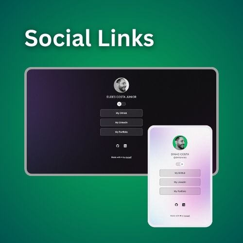

<h1 align="center"> Social Links </h1>

A simple and neat profile page that displays social links. 
<!-- <a href="#">Estude esse projeto em formato de vídeo clicando aqui.</a>

 -->

  <a href="#-technologies">Technologies</a>&nbsp;&nbsp;&nbsp;|&nbsp;&nbsp;&nbsp;
  <a href="#-project">Project</a>&nbsp;&nbsp;&nbsp;|&nbsp;&nbsp;&nbsp;
  <a href="#-layout">Layout</a>&nbsp;&nbsp;&nbsp;|&nbsp;&nbsp;&nbsp;
  <a href="#-license">License</a>

  

 

  

## 🚀 Technologies

This project was built using the following technologies:

- HTML and CSS
- JavaScript
- Git and Github
- Figma

## 💻 Project

<strong>Social Links</strong> is a link aggregator to use as an online business card.

- [Access the finished project online.](https://dinhocosta.github.io/social-links)

<!-- - [Assistir aulas](https://lp.rocketseat.com.br/devlinks/inscricao?utm_source=github&utm_medium=descricao&utm_campaign=capture-devlinks&utm_term=organic&utm_content=descricao-github-mayk-brito) -->

## 🎨 Layout

You can access this project's layout through [THIS LINK](https://www.figma.com/community/file/1187422022288947321). It is necessary to have a [Figma](https://figma.com) account to access the design.

## 📝 License

This project is under the MIT license.

---

Made with ♥ by myself 👋🏽

<!-- [Participe da nossa comunidade!](https://discord.gg/rocketseat) -->
